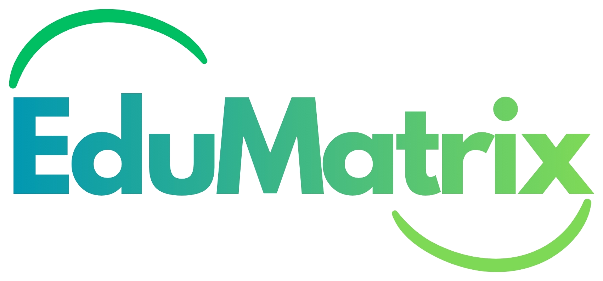

<div align="center">



# EduMatrix

### Where Education Meets Intelligence

[](https://djangoproject.com)
[](https://python.org)
[](https://supabase.com)
[](https://tailwindcss.com)
[](LICENSE)

**A comprehensive, AI-powered education management platform for students, teachers, and institutions.**

[Features](#-features) · [Tech Stack](#-tech-stack) · [Getting Started](#-getting-started) · [Architecture](#-architecture) · [Screenshots](#-screenshots) · [Deployment](#-deployment) · [Contributing](#-contributing)

</div>

---

## 📖 Overview

EduMatrix is a full-stack, multi-tenant education management system (EMS) built for the modern institution. It unifies academic administration, AI-assisted learning, real-time communication, and analytics into a single, cohesive platform — designed for **students**, **teachers**, and **administrators** alike.

> Built with Django 6, Supabase (PostgreSQL), Tailwind CSS v4, and integrated with Google AI for intelligent features.

---

## ✨ Features

### 👨‍🎓 Student Portal
- Personalised **student dashboard** with XP, achievements, and activity feed
- View **assignments**, submit work, and track grades in real time
- **AI Quiz Generator** — auto-generate quizzes from any topic or study material
- **AI Chat Assistant** — contextual learning support powered by Google Gemini
- Attendance tracking, timetable view, leave requests
- Integrated **Notes**, **Planner**, **To-Do**, and **Kanban board**
- **Library resource** browser and fee record viewer
- Forum participation and messaging

### 👩‍🏫 Teacher Portal
- Full **classroom management** — create classes, manage students, post notices
- **Assignment creation** with plagiarism flagging
- **Attendance marking** with class-level views
- Grade entry and **grade analytics**
- Access to **student XP** and progress analytics
- AI-powered tools: quiz builder, smart command center

### 🏫 Admin / Institution Portal
- **Multi-tenant architecture** — one platform, multiple institutions, full data isolation
- **Admin dashboard** with platform-wide analytics
- Manage departments, courses, and class schedules
- Inventory management, bus routes, circulars
- **Event management**, polls, help & FAQ management
- Activity log and audit trail
- **Launch Center** for feature rollout control

### 🤖 AI & Intelligence Layer
- Google Gemini integration for AI chat and quiz generation
- Sarvam AI integration for regional language support
- AI services abstracted via `dashboard/ai_services.py` (swap providers easily)

### 🔐 Security & Auth
- OTP-based email verification at signup
- Supabase Auth integration with JWT
- Role-based access control (student / teacher / admin)
- CSRF protection, secure cookies, HSTS, SSL redirect
- Rate limiting middleware

---

## 🛠 Tech Stack

| Layer | Technology |
|---|---|
| **Backend Framework** | Django 6.0 |
| **Database** | Supabase (PostgreSQL via psycopg3) |
| **Auth** | Django Auth + Supabase Auth + OTP Email Verification |
| **Frontend** | Django Templates + Tailwind CSS v4 (django-tailwind) |
| **AI** | Google Gemini API, Sarvam AI |
| **Email** | Resend API |
| **Media / Files** | Django FileField + WhiteNoise |
| **API** | Django REST Framework |
| **CORS** | django-cors-headers |
| **Production Server** | Gunicorn + WhiteNoise |
| **Deployment** | Render / any Procfile-compatible host |

---

## 📁 Project Structure

```
EduMatrix/
├── backend/                        # Django backend (the entire application)
│   ├── academics/                  # Courses, classes, schedules, grades, exams
│   ├── accounts/                   # User model, auth, OTP, email, roles
│   ├── assignments/                # Assignment creation & submission
│   ├── attendance/                 # Attendance records & leave requests
│   ├── dashboard/                  # Core dashboard: notices, events, fees, AI
│   │   ├── ai_services.py          # AI provider abstraction layer
│   │   ├── views.py                # Main view routing
│   │   └── views_features.py       # Feature-flag-gated views
│   ├── forum/                      # Discussion threads and posts
│   ├── messaging/                  # Internal inbox and compose
│   ├── quizzes/                    # AI quiz engine and manual quiz builder
│   ├── edumatrix/                  # Project config (settings, urls, wsgi, asgi)
│   ├── templates/                  # All HTML templates
│   │   ├── base.html               # Base layout shell
│   │   ├── landing.html            # Public landing page
│   │   ├── accounts/               # Auth pages (login, signup, OTP)
│   │   └── dashboard/              # Role-specific dashboards and features
│   ├── static/                     # Project static assets (CSS, JS, images)
│   ├── manage.py
│   ├── requirements.txt
│   ├── Procfile                    # Gunicorn start command for Render/Heroku
│   ├── .env.example                # Environment variable reference
│   └── DEPLOYMENT.md               # Full production deployment guide
├── docs/                           # Additional documentation and design specs
├── static/                         # Shared/root static assets
└── README.md
```

---

## 🚀 Getting Started

### Prerequisites

- Python 3.12+
- A [Supabase](https://supabase.com) project (free tier works)
- Git

### 1. Clone the Repository

```bash
git clone https://github.com/yuvrajjitbaruah/EduMatrix.git
cd EduMatrix
```

### 2. Set Up the Backend

```bash
cd backend

# Create and activate a virtual environment
python -m venv venv
source venv/bin/activate        # Windows: venv\Scripts\activate

# Install dependencies
pip install -r requirements.txt
```

### 3. Configure Environment Variables

```bash
cp .env.example .env
```

Open `.env` and fill in your values:

```env
DJANGO_SECRET_KEY=your-generated-secret-key
DJANGO_DEBUG=True

SUPABASE_DB_USER=your-supabase-db-user
SUPABASE_DB_PASSWORD=your-supabase-db-password
SUPABASE_DB_HOST=your-supabase-db-host
SUPABASE_DB_NAME=postgres
SUPABASE_DB_PORT=5432

# Optional (for AI features)
GOOGLE_AI_API_KEY=your-google-ai-key
SARVAM_API_KEY=your-sarvam-key

# Optional (for email)
RESEND_API_KEY=your-resend-key
```

> **Generate a secret key:**
> ```bash
> python -c "from django.core.management.utils import get_random_secret_key; print(get_random_secret_key())"
> ```

### 4. Run Migrations & Start Server

```bash
python manage.py migrate
python manage.py createsuperuser   # optional: create an admin user
python manage.py runserver
```

Visit **http://127.0.0.1:8000** — the platform is live.

---

## 🏗 Architecture

```
┌─────────────────────────────────────────────────────┐
│                    Browser / Client                  │
└────────────────────────┬────────────────────────────┘
                         │ HTTP / HTTPS
┌────────────────────────▼────────────────────────────┐
│              Django 6 Application Server             │
│  ┌──────────┐ ┌──────────┐ ┌──────────────────────┐ │
│  │ accounts │ │dashboard │ │  academics / quizzes  │ │
│  │   auth   │ │  AI svc  │ │  forum / messaging   │ │
│  └──────────┘ └────┬─────┘ └──────────────────────┘ │
│                    │                                 │
│  ┌─────────────────▼───────────────────────────────┐ │
│  │         Django ORM (psycopg3)                   │ │
│  └─────────────────────────────────────────────────┘ │
└────────────────────────┬────────────────────────────┘
                         │
          ┌──────────────▼──────────────┐
          │   Supabase (PostgreSQL)      │
          │   Multi-tenant data store    │
          └─────────────────────────────┘
                         │
          ┌──────────────▼──────────────┐
          │  External APIs               │
          │  • Google Gemini (AI)        │
          │  • Sarvam AI (vernacular)    │
          │  • Resend (email)            │
          └─────────────────────────────┘
```

### Multi-Tenancy Model

Each `Institution` has its own scoped data. Users, classes, notices, fees, and all academic records are institution-scoped at the database level via FK constraints — meaning a single deployed instance can serve multiple schools or colleges in complete isolation.

---

## 📸 Screenshots

> *Add screenshots or a GIF walkthrough here to really impress recruiters.*
>
> Suggested shots:
> - Landing page
> - Student dashboard
> - Teacher dashboard
> - Admin dashboard
> - AI chat interface
> - AI quiz generator

---

## 🚢 Deployment

See [`backend/DEPLOYMENT.md`](backend/DEPLOYMENT.md) for the full step-by-step production deployment guide (Render-ready, Procfile-based).

**Quick summary:**

```bash
# Build
pip install -r requirements.txt
python manage.py collectstatic --noinput
python manage.py migrate

# Start
gunicorn edumatrix.wsgi:application --bind 0.0.0.0:$PORT --workers 3 --timeout 120
```

Set all production environment variables in your host's dashboard (never in code).

---

## 🧪 Running Tests

```bash
cd backend
python manage.py test academics dashboard accounts attendance quizzes --verbosity 2
```

---

## 🗺 Roadmap

- [ ] REST API with DRF for mobile app support
- [ ] Real-time notifications (Django Channels / WebSockets)
- [ ] Parent portal
- [ ] Advanced analytics dashboard with charts
- [ ] Mobile app (React Native)
- [ ] Offline-first PWA support

---

## 🤝 Contributing

Contributions are welcome! If you'd like to improve EduMatrix:

1. Fork the repo
2. Create a feature branch (`git checkout -b feature/your-feature`)
3. Commit your changes (`git commit -m 'Add your feature'`)
4. Push to the branch (`git push origin feature/your-feature`)
5. Open a Pull Request

Please follow the existing code style and include tests for new features.

---

## 👨‍💻 Author

**Yuvrajjit Baruah**

[](https://github.com/yuvrajjitbaruah)

---

## 📄 License

This project is licensed under the MIT License — see the [LICENSE](LICENSE) file for details.

---

<div align="center">

*Built with ❤️ using Django, Supabase, and a lot of chai ☕*

</div>
