<div align="center">

# EduMatrix
### Where Education Meets Intelligence

[](https://djangoproject.com)
[](https://python.org)
[](https://supabase.com)
[](https://tailwindcss.com)
[](https://edumatrix.tech)
[](LICENSE)

**A production-ready, AI-powered education management platform for students, teachers, and institutions.**

🌐 **[Live Demo](https://edumatrix.tech)** · [Features](#-features) · [Screenshots](#-screenshots) · [Tech Stack](#-tech-stack) · [Getting Started](#-getting-started) · [Architecture](#-architecture) · [Deployment](#-deployment)

</div>

---

## 🏠 Landing Page

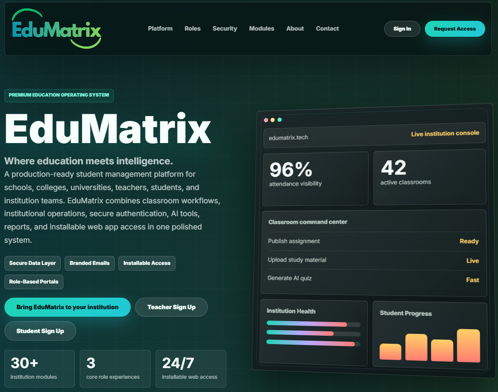

> *Premium Education Operating System — 30+ institution modules, 3 core role experiences, 24/7 installable web access.*

---

## 📖 Overview

EduMatrix is a full-stack, multi-tenant Education Management System (EMS) built for the modern institution. It unifies academic administration, AI-assisted learning, real-time communication, and analytics into a single, cohesive platform — purpose-built for **students**, **teachers**, and **administrators**.

- ✅ **Production deployed** at [edumatrix.tech](https://edumatrix.tech)
- ✅ **Multi-tenant** — one platform, unlimited institutions, complete data isolation
- ✅ **AI-powered** — Google Gemini for chat assistance and quiz generation
- ✅ **PWA-ready** — installable as a native app on any device
- ✅ **Role-based** — distinct portals for Platform Admin, Institution Admin, Teacher, and Student

---

## 📸 Screenshots

### Platform Overview

| | |
|---|---|
| 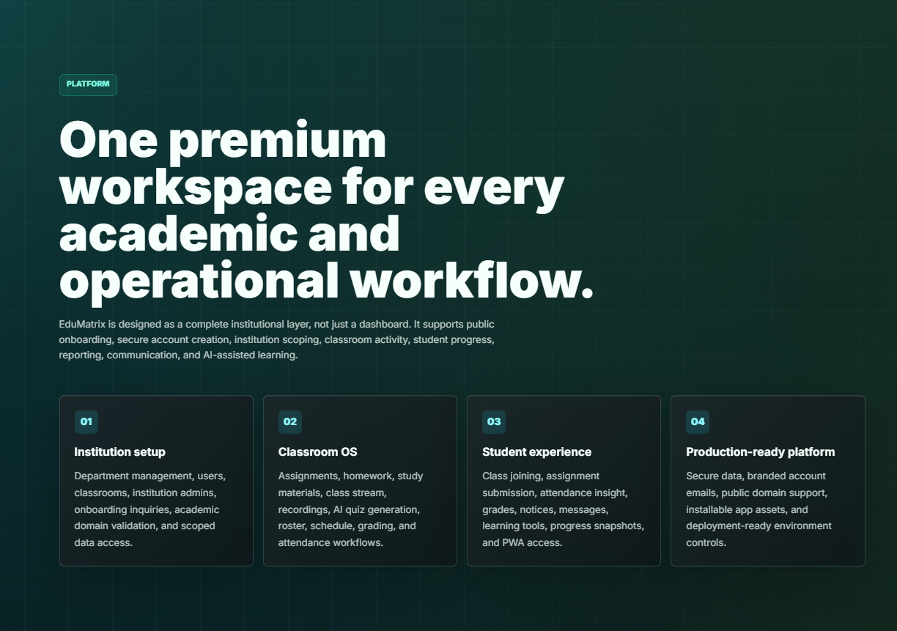 | 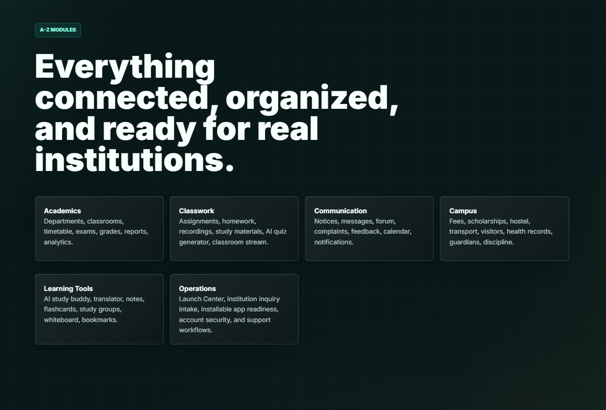 |
| *One premium workspace for every academic and operational workflow* | *Everything connected, organized, and ready for real institutions* |

### Role-Based Access

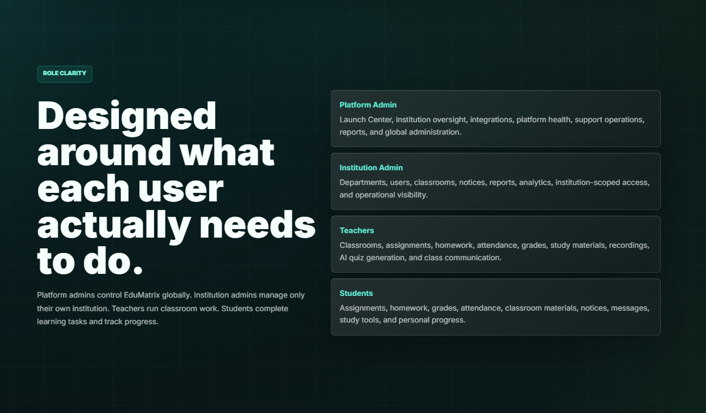
*Designed around what each user actually needs to do — Platform Admin, Institution Admin, Teacher, and Student each get their own scoped experience.*

### Student Dashboard

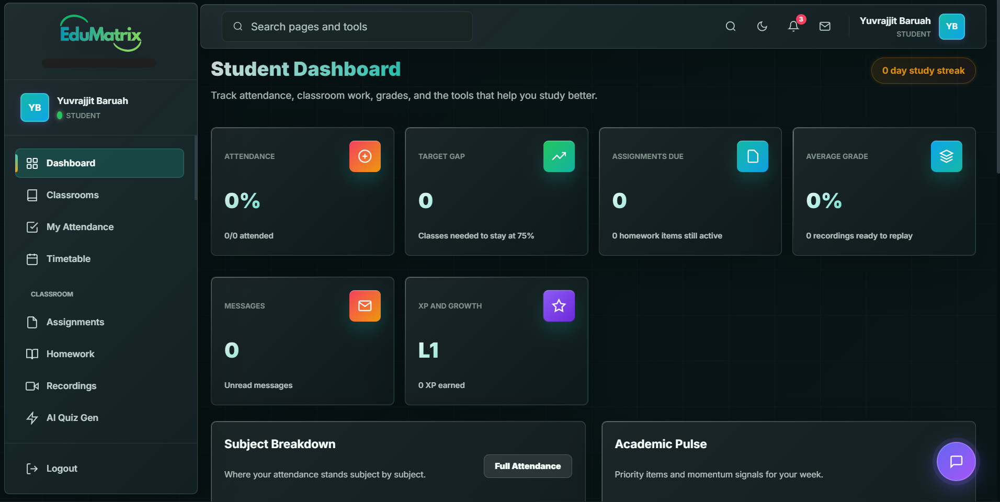
*Real-time tracking of attendance, assignments due, average grade, XP & growth, and unread messages — all in one view.*

### AI-Powered EduBot

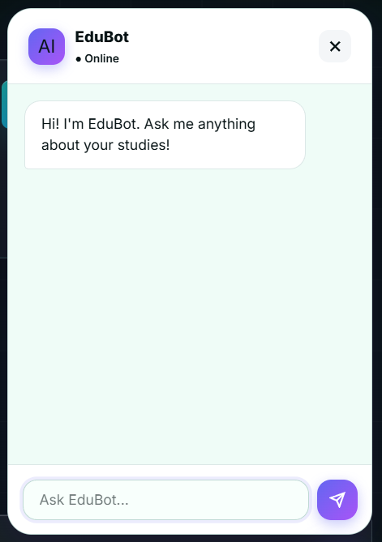
*EduBot — an AI study assistant powered by Google Gemini, available on every page. Ask anything about your studies.*

### Institution Onboarding Flow

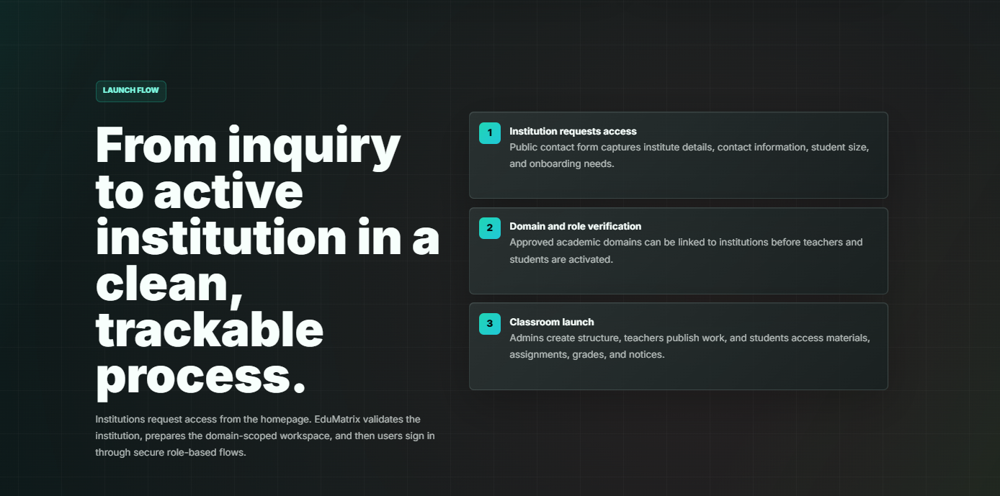
*From inquiry to active institution in a clean, trackable 3-step process.*

### Security & Trust

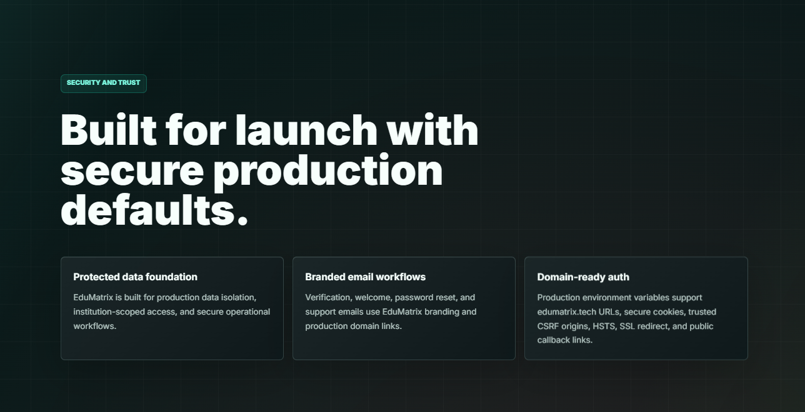
*Built for launch with secure production defaults — data isolation, branded email workflows, HSTS, SSL, and CSRF protection.*

### Profile & Account Settings

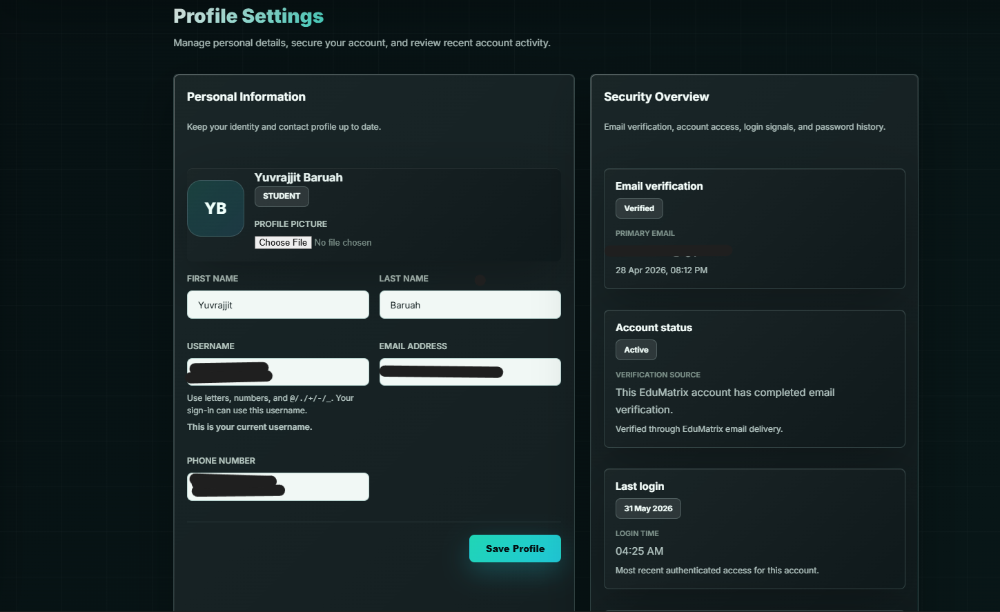
*Full profile management with security overview, email verification status, and login activity tracking.*

### About & Contact

| | |
|---|---|
| 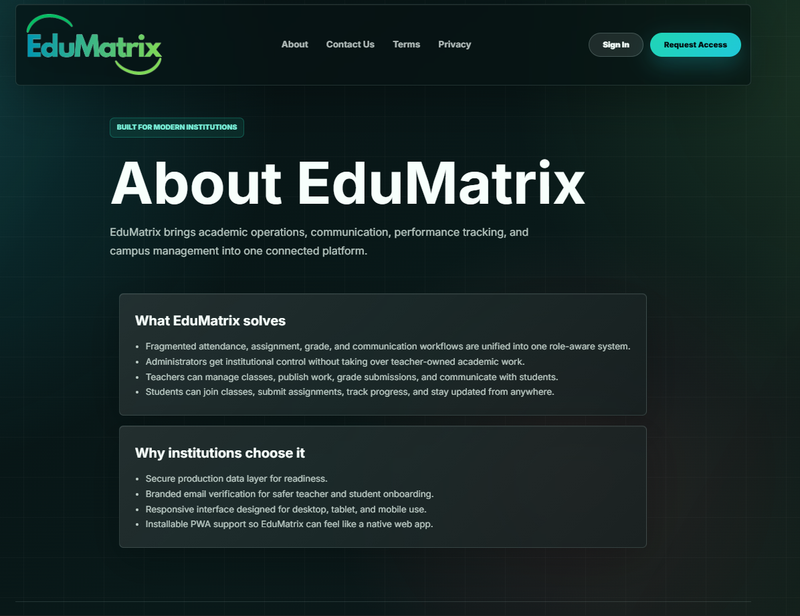 | 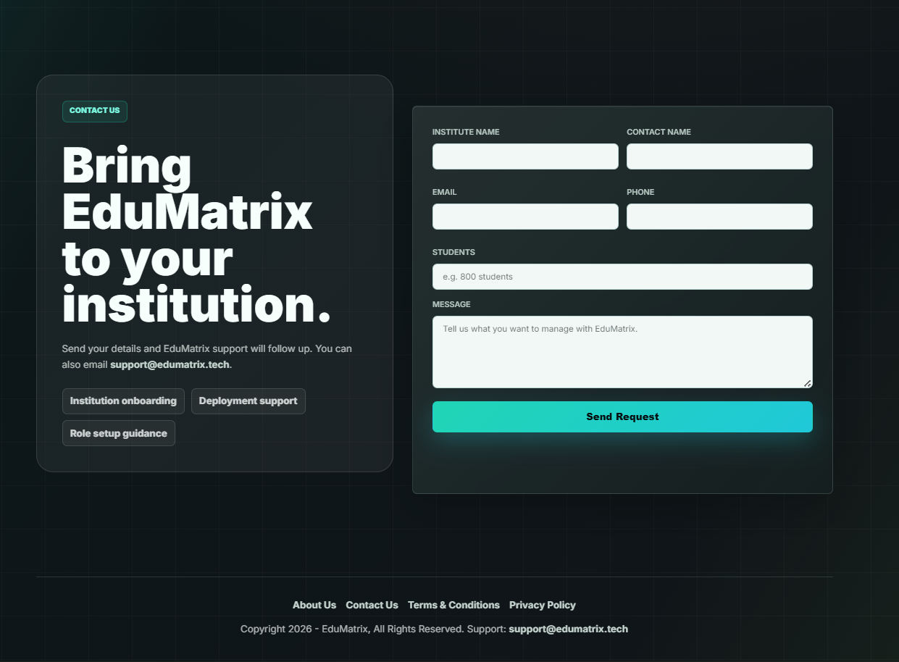 |
| *What EduMatrix solves and why institutions choose it* | *Bring EduMatrix to your institution — onboarding request form* |

### More Platform Sections

| | |
|---|---|
| 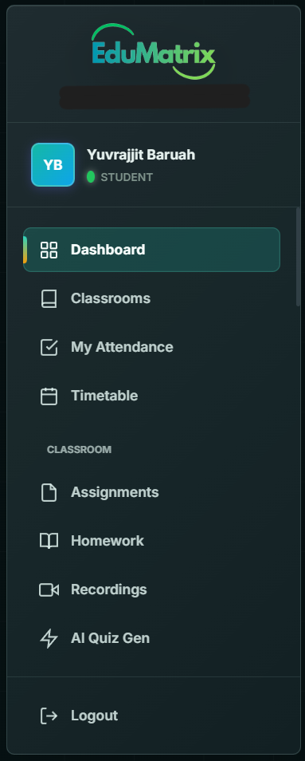 | 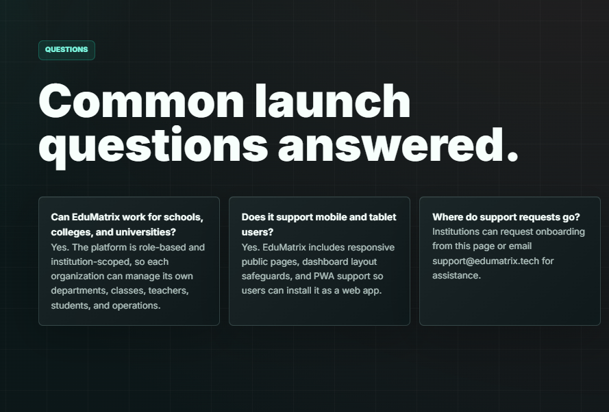 |
| *Extended feature set across every role* | *Common launch questions answered* |

---

## ✨ Features

### 👨‍🎓 Student Portal
- Personalised **Student Dashboard** — attendance, grades, assignments, XP & growth tracking
- **AI Quiz Generator** — auto-generate quizzes from any topic using Google Gemini
- **EduBot AI Assistant** — contextual study support, always available
- Attendance tracking, timetable view, leave requests
- Integrated **Notes**, **Planner**, **To-Do**, and **Kanban board**
- Library resource browser, fee record viewer, forum participation

### 👩‍🏫 Teacher Portal
- Full **classroom management** — create classes, manage students, post notices
- Assignment creation with plagiarism flagging
- Attendance marking with class-level views and reports
- Grade entry and grade analytics
- AI-powered quiz builder and smart command center

### 🏫 Admin / Institution Portal
- **Multi-tenant architecture** — full data isolation per institution
- Admin dashboard with platform-wide analytics
- Manage departments, courses, and class schedules
- Inventory, bus routes, circulars, event management, polls
- Activity log and audit trail
- **Launch Center** for feature rollout control

### 🤖 AI & Intelligence Layer
- Google Gemini integration for EduBot chat and AI quiz generation
- Sarvam AI integration for regional language support
- AI services abstracted via `dashboard/ai_services.py` — swap providers easily

### 🔐 Security
- OTP-based email verification at signup
- Supabase Auth integration with JWT
- Role-based access control (4 distinct roles)
- CSRF protection, secure cookies, HSTS, SSL redirect
- Rate limiting middleware, institution-scoped data access

---

## 🛠 Tech Stack

| Layer | Technology |
|---|---|
| **Backend Framework** | Django 6.0 |
| **Database** | Supabase (PostgreSQL via psycopg3) |
| **Auth** | Django Auth + Supabase Auth + OTP Email Verification |
| **Frontend** | Django Templates + Tailwind CSS v4 |
| **AI** | Google Gemini API, Sarvam AI |
| **Email** | Resend API with branded templates |
| **API** | Django REST Framework |
| **Production Server** | Gunicorn + WhiteNoise |
| **Deployment** | cPanel / Procfile-compatible hosts |
| **PWA** | Web App Manifest + Service Worker |

---

## 📁 Project Structure

```
EduMatrix/
├── backend/                        # Django application
│   ├── academics/                  # Courses, classes, schedules, grades, exams
│   ├── accounts/                   # User model, auth, OTP, email, roles
│   ├── assignments/                # Assignment creation & submission
│   ├── attendance/                 # Attendance records & leave requests
│   ├── dashboard/                  # Core dashboard: notices, events, fees, AI
│   │   ├── ai_services.py          # AI provider abstraction layer
│   │   ├── views.py                # Main view routing
│   │   └── views_features.py       # Feature-flag-gated views
│   ├── forum/                      # Discussion threads and posts
│   ├── messaging/                  # Internal inbox and compose
│   ├── quizzes/                    # AI quiz engine and manual quiz builder
│   ├── edumatrix/                  # Project config (settings, urls, wsgi, asgi)
│   ├── templates/                  # All HTML templates (base, dashboard, auth)
│   ├── static/                     # CSS, JS, images, PWA manifest
│   ├── manage.py
│   ├── requirements.txt
│   ├── Procfile
│   ├── .env.example                # Environment variable reference
│   └── DEPLOYMENT.md               # Full production deployment guide
├── docs/
│   └── screenshots/                # App screenshots
└── README.md
```

---

## 🚀 Getting Started

### Prerequisites
- Python 3.12+
- A [Supabase](https://supabase.com) project (free tier works)

### 1. Clone the Repository
```bash
git clone https://github.com/yuvrajjitbaruah/EduMatrix.git
cd EduMatrix
```

### 2. Set Up the Backend
```bash
cd backend
python -m venv venv
source venv/bin/activate        # Windows: venv\Scripts\activate
pip install -r requirements.txt
```

### 3. Configure Environment Variables
```bash
cp .env.example .env
```

Open `.env` and fill in your values:
```env
DJANGO_SECRET_KEY=your-generated-secret-key
DJANGO_DEBUG=True

SUPABASE_DB_USER=your-supabase-db-user
SUPABASE_DB_PASSWORD=your-supabase-db-password
SUPABASE_DB_HOST=your-supabase-db-host

# Optional — for AI features
GOOGLE_AI_API_KEY=your-google-ai-key
SARVAM_API_KEY=your-sarvam-key

# Optional — for email
RESEND_API_KEY=your-resend-key
```

> Generate a secret key:
> ```bash
> python -c "from django.core.management.utils import get_random_secret_key; print(get_random_secret_key())"
> ```

### 4. Run Migrations & Start Server
```bash
python manage.py migrate
python manage.py runserver
```

Visit **http://127.0.0.1:8000** 🎉

---

## 🏗 Architecture

```
┌─────────────────────────────────────────────────┐
│                Browser / PWA Client              │
└──────────────────────┬──────────────────────────┘
                       │ HTTPS
┌──────────────────────▼──────────────────────────┐
│           Django 6 Application Server            │
│  ┌──────────┐ ┌──────────┐ ┌──────────────────┐ │
│  │ accounts │ │dashboard │ │ academics/quizzes │ │
│  │ auth/OTP │ │ EduBot   │ │ forum/messaging  │ │
│  └──────────┘ └────┬─────┘ └──────────────────┘ │
│                    │ Django ORM (psycopg3)        │
└────────────────────┼────────────────────────────┘
                     │
        ┌────────────▼────────────┐
        │  Supabase (PostgreSQL)   │
        │  Multi-tenant data store │
        └────────────┬────────────┘
                     │
        ┌────────────▼────────────┐
        │  External APIs           │
        │  • Google Gemini (AI)    │
        │  • Sarvam AI (vernacular)│
        │  • Resend (email)        │
        └─────────────────────────┘
```

### Multi-Tenancy Model
Each `Institution` has fully scoped data. Users, classes, notices, fees, and all academic records are isolated at the database level via FK constraints — a single deployed instance serves multiple schools or colleges in complete isolation.

---

## 🚢 Deployment

See [`backend/DEPLOYMENT.md`](backend/DEPLOYMENT.md) for the full production guide.

```bash
# Build
pip install -r requirements.txt
python manage.py collectstatic --noinput
python manage.py migrate

# Start
gunicorn edumatrix.wsgi:application --bind 0.0.0.0:$PORT --workers 3 --timeout 120
```

---

## 🧪 Running Tests

```bash
cd backend
python manage.py test academics dashboard accounts attendance quizzes --verbosity 2
```

---

## 🗺 Roadmap

- [ ] REST API with DRF for mobile app support
- [ ] Real-time notifications (WebSockets)
- [ ] Parent portal
- [ ] Advanced analytics with charts
- [ ] React Native mobile app

---

## 👨‍💻 Author

**Yuvrajjit Baruah**

[](https://github.com/yuvrajjitbaruah)

---

## 📄 License

Licensed under the Apache 2.0 License — see [LICENSE](LICENSE) for details.

---

<div align="center">

*Built with ❤️ using Django, Supabase, and a lot of chai ☕*

**[⭐ Star this repo if you found it useful!](https://github.com/yuvrajjitbaruah/EduMatrix)**

</div>
